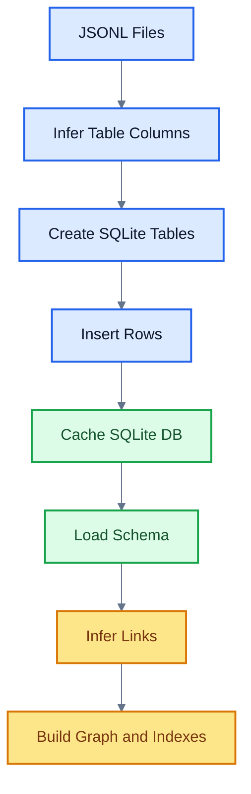
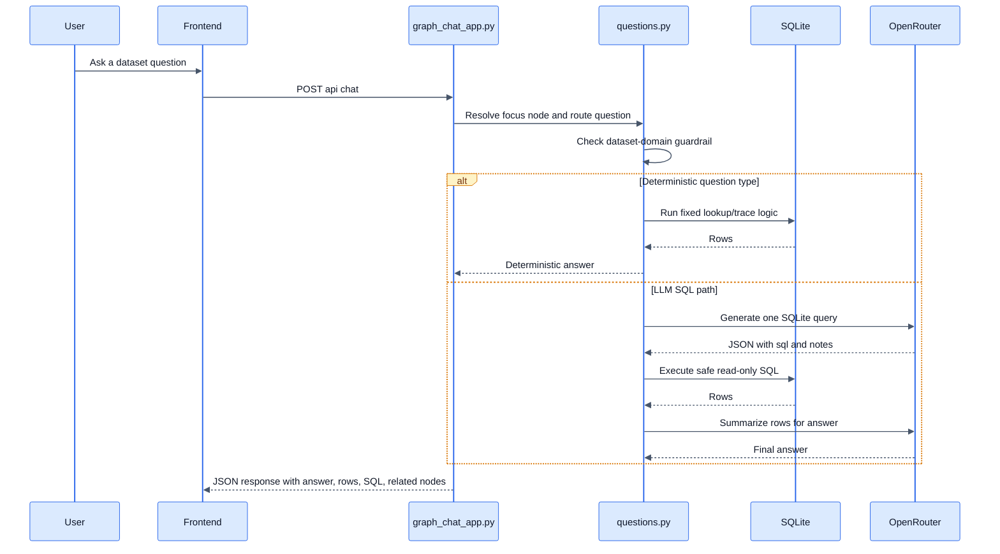
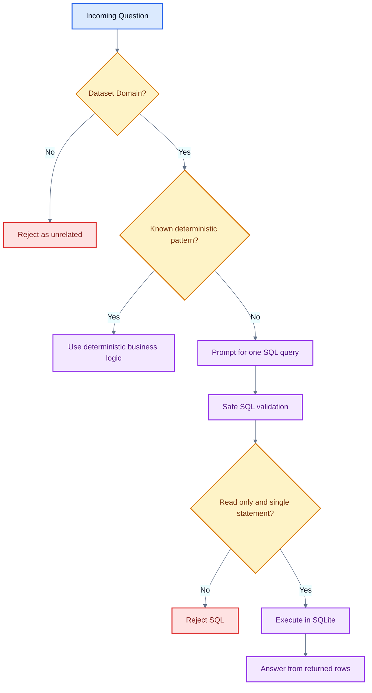

# DodgeChat

This repo now includes two ways to work with the SAP order-to-cash dataset in `sap-order-to-cash-dataset/sap-o2c-data`:

- `ask_dataset.py` for quick CLI Q&A
- `graph_chat_app.py` for a browser graph + chat experience

## Live Demo

- Render deployment: [https://dodgechat.onrender.com/](https://dodgechat.onrender.com/)

Note:

- On first open, the deployed app may take some time to load the graph data
- If Render shows its default loading screen, no worries, the application is starting up
- The app should usually become available within about 2 minutes at most

## Architecture Overview

DodgeChat is intentionally built as a small Python-first application with a thin browser UI. The backend owns dataset loading, graph construction, SQL generation, SQL execution, and answer synthesis. The frontend focuses on graph interaction and chat presentation.

```mermaid
%%{init: {'theme': 'base', 'themeVariables': { 'primaryColor': '#e8f1ff', 'primaryTextColor': '#0f172a', 'primaryBorderColor': '#2563eb', 'lineColor': '#475569', 'secondaryColor': '#ecfeff', 'tertiaryColor': '#fef3c7' }}}%%
flowchart LR
    A[JSONL SAP O2C Dataset] --> B[SQLite Cache Builder]
    B --> C[AppState Initialization]
    C --> D[Graph Builder]
    C --> E[Value Index and Node Details]
    D --> F[UI Graph Payload]
    F --> G[HTTP Server]
    G --> H[Browser UI]
    H --> I[API Chat Endpoint]
    I --> J[Question Router]
    J --> K[Deterministic Answer Path]
    J --> L[LLM SQL Path]
    L --> M[SQLite Read Only Query]
    K --> N[JSON Response]
    M --> N[JSON Response]
    classDef data fill:#dbeafe,stroke:#2563eb,color:#0f172a,stroke-width:2px;
    classDef app fill:#dcfce7,stroke:#16a34a,color:#14532d,stroke-width:2px;
    classDef ui fill:#fef3c7,stroke:#d97706,color:#78350f,stroke-width:2px;
    classDef logic fill:#f3e8ff,stroke:#9333ea,color:#581c87,stroke-width:2px;
    classDef output fill:#fee2e2,stroke:#dc2626,color:#7f1d1d,stroke-width:2px;
    class A,B data;
    class C,D,E,F,G app;
    class H,I ui;
    class J,K,L,M logic;
    class N output;
```



## Why This Architecture

- The app uses the Python standard library server instead of a heavier web framework to keep the runtime simple and easy to run locally.
- The system centralizes most intelligence in backend modules so the browser stays lightweight and mostly stateless.
- A graph-first UI helps users navigate the order-to-cash process visually while still supporting natural-language questions.
- Deterministic answer paths are used before LLM SQL generation whenever the question matches a known business pattern such as billing status, customer billing, customer sales orders, or full-flow tracing.

## Configuration

Store your OpenRouter settings in `.env`:

Create an OpenRouter API key here: [OpenRouter API Keys](https://openrouter.ai/workspaces/default/keys)

```powershell
OPENROUTER_API_KEY=your_key_here
OPENROUTER_BASE_URL=https://openrouter.ai/api/v1
OPENAI_MODEL=openai/gpt-4.1-mini
OPENROUTER_MAX_TOKENS=1200
```

No third-party Python runtime packages are required for the current version.

## Local Setup

Clone the repo and move into the project:

```bash
git clone https://github.com/vandanamv/DodgeChat.git
cd DodgeChat
```

Create a `.env` file with your OpenRouter credentials, then run the app.

Run the server directly:

```powershell
python graph_chat_app.py
```

Or with one command from Bash:

```bash
bash run.sh
```

Then open `http://127.0.0.1:8000`.

Local setup notes:

- The app reads the host and port from environment variables when available
- For local development you can keep using `http://127.0.0.1:8000`
- For deployment platforms like Render, the app binds to `0.0.0.0` and uses the platform-provided `PORT`

## Graph App

What the graph app does:

- loads the JSONL dataset into SQLite
- builds a connected process graph across orders, deliveries, billing, journal entries, payments, customers, products, and plants
- visualizes the graph in the browser
- lets the LLM translate natural-language questions into SQLite dynamically
- executes the generated query and answers with returned data

Notes:

- the browser graph uses Cytoscape from a CDN
- SQL execution is restricted to one read-only `SELECT` or `WITH` query
- joins can use `norm_id(...)` for item numbers like `10` and `000010`

## Deployment

The app is deployed on Render:

- Production URL: [https://dodgechat.onrender.com/](https://dodgechat.onrender.com/)
- Build command: `pip install -r requirements.txt`
- Start command: `python graph_chat_app.py`

Required Render environment variables:

- `OPENROUTER_API_KEY`
- `OPENROUTER_BASE_URL=https://openrouter.ai/api/v1`
- `OPENAI_MODEL=openai/gpt-4.1-mini`
- `OPENROUTER_MAX_TOKENS=1200`

To make every push update the deployment automatically:

- connect the GitHub repo to Render
- deploy the `main` branch
- keep Render auto-deploy enabled for the service

With that setup, each new commit pushed to `main` triggers a fresh Render deploy automatically.

## Main Components

- [graph_chat_app.py](c:\Users\vinod\OneDrive\Desktop\DodgeChat\graph_chat_app.py): HTTP entrypoint, static file serving, `/api/graph`, `/api/health`, and `/api/chat`
- [dodgechat/state.py](c:\Users\vinod\OneDrive\Desktop\DodgeChat\dodgechat\state.py): dataset loading, SQLite caching, inferred links, graph building, UI graph payload creation
- [dodgechat/questions.py](c:\Users\vinod\OneDrive\Desktop\DodgeChat\dodgechat\questions.py): prompt routing, deterministic answer paths, SQL prompting, SQL repair, answer generation
- [dodgechat/runtime.py](c:\Users\vinod\OneDrive\Desktop\DodgeChat\dodgechat\runtime.py): dotenv loading, OpenRouter calls, SQL safety checks, cache helpers, ID normalization helpers
- [Frontend/src](c:\Users\vinod\OneDrive\Desktop\DodgeChat\Frontend\src): Cytoscape graph rendering, browser chat UI, interaction handling

## Database Choice

SQLite is the right fit for this project because the data is local, read-heavy, and structured enough to benefit from SQL joins without requiring a separate database service.

- Zero setup: users can run the app without provisioning Postgres, MySQL, or MongoDB
- Fast local iteration: JSONL files are transformed into a cached SQLite database once and then reused
- Strong fit for analytics-style questions: the app needs ad hoc filtering, joining, grouping, and tracing across SAP entities
- Safer execution model: the app can restrict generated SQL to one read-only statement
- Portable cache: the database lives in `.cache/o2c_cache.sqlite3`, which keeps the runtime self-contained



## Request Lifecycle

The chat pipeline is designed to avoid unnecessary LLM calls and to preserve business context from the selected graph node.



## LLM Prompting Strategy

The LLM is used as a bounded planner and explainer, not as the source of truth.

- First role: generate one SQLite query from schema text, selected graph-node context, and recent chat history
- Second role: repair the query if SQLite returns an error
- Third role: turn returned rows into a concise answer grounded in actual query results
- Deterministic handlers bypass SQL prompting entirely for questions that are better served by business-specific logic
- Focus-node context is included so a selected Sales Order, Delivery, Billing Document, Customer, or Product steers the answer toward the current graph context

The prompting style is intentionally narrow:

- strict JSON output for SQL planning steps
- explicit instruction to use one read-only SQLite query
- explicit instruction not to invent tables or columns
- schema text provided inline
- recent chat history clipped to a small recent window

## Guardrails

The safety model combines prompt restrictions with application-level enforcement.

- Domain guardrail: off-topic prompts are rejected before SQL generation
- SQL guardrail: only one `SELECT` or `WITH` statement is allowed
- Banned statement guardrail: `INSERT`, `UPDATE`, `DELETE`, `DROP`, `ALTER`, `PRAGMA`, `ATTACH`, `DETACH`, `CREATE`, `REPLACE`, `VACUUM`, and `TRUNCATE` are blocked
- Result grounding: final answers are generated from actual query rows, not free-form model speculation
- Deterministic preference: known business questions use code paths instead of model-generated SQL
- Fallback reasoning: when row-based results are weak, the app can answer from graph relationships already inferred from the dataset



## Data and Graph Model

The graph represents SAP order-to-cash entities such as:

- Sales Orders
- Sales Order Items
- Deliveries
- Billing Documents
- Journal Entries
- Payments
- Customers
- Products
- Plants

Links come from two sources:

- fixed process links that encode known business relationships
- inferred links based on overlapping normalized identifiers across tables

This hybrid approach keeps the graph useful even when the source data does not include perfectly explicit foreign-key metadata.

## Caching Strategy

- SQLite cache: `.cache/o2c_cache.sqlite3`
- Graph cache: `.cache/graph_cache.json`
- Cache invalidation uses a dataset signature derived from file names, sizes, mtimes, and cache version

This avoids rebuilding the entire graph on every run while still refreshing when the dataset changes.

## Tradeoffs and Decisions

- SQLite over MongoDB: the workload is relational and query-centric, so SQL joins and aggregations are a better fit than document traversal
- Standard library HTTP server over FastAPI or Flask: simpler dependency story and easier local execution
- Prompted SQL over hardcoded reporting only: more flexible for exploratory questions
- Deterministic routing before LLM: better reliability for common business queries
- Graph UI plus chat instead of chat alone: users can anchor questions to a visible business object and inspect related records quickly

## CLI

Ask a question directly:

```powershell
python ask_dataset.py "What is the billing status for sales order 740506?"
```

Show retrieved context before the answer:

```powershell
python ask_dataset.py "Show billing details for customer 1000001" --show-context
```
